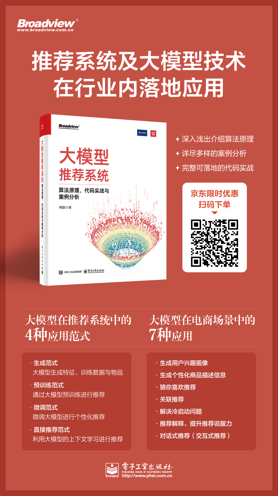
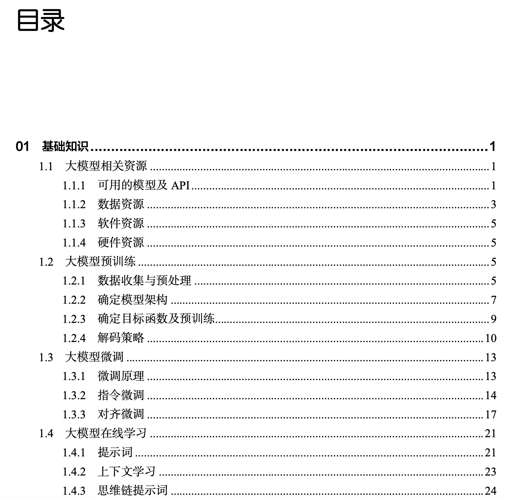

# llm4rec_abc

本项目由**杭州数卓信息技术有限公司开发**。

为了帮助读者更好地学习**大模型推荐系统**，我们编写了本代码，帮助读者更好地理解大模型推荐算法。

本代码是跟图书和在线课程配套的学习资源，读者可以选择购买。

## 1. 配套图书

京东购买链接：https://item.jd.com/14808682.html

### 图书目录
[点击查看 完整的图书目录](./book/图书介绍&目录.pdf)

## 2. 配套在线课程
在线课程链接：http://mp.weixin.qq.com/mp/homepage?__biz=Mzk0MzE3MDEyNQ==&hid=10&sn=12047ed80890f758a1d16ef9e0474191&scene=18#wechat_redirect

## 3. 支持
如果觉得我们的代码对你有帮助，可以给我们打赏，谢谢！

## 4. 联系作者
如果你（公司）有关于搜索、推荐、精细化运营、知识库、大模型赋能企业应用等相关需求，请联系我们。

